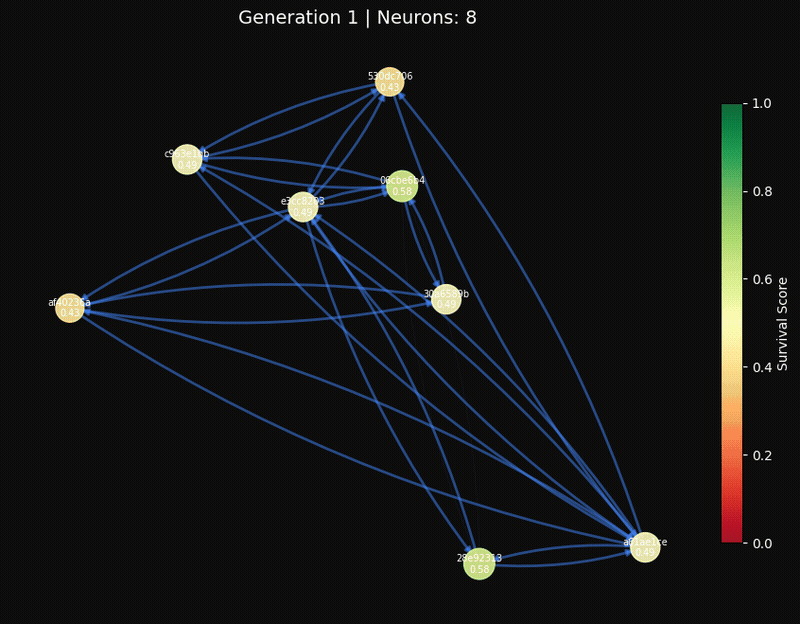
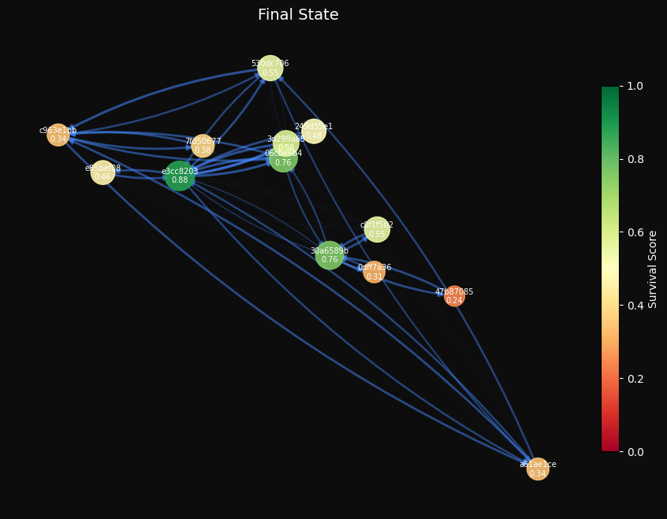
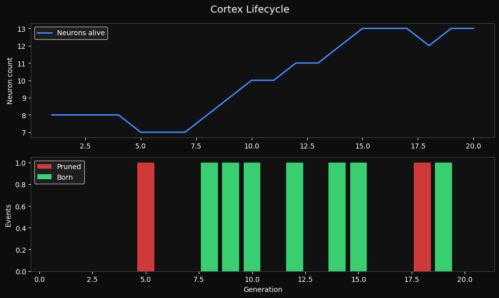

# Colony — Neural Darwinism Agent System

A multi-agent system where LLM agents compete for survival using principles from Gerald Edelman's Neural Darwinism theory. Agents with specialized LoRA adapters generate responses, compete via fitness scoring, and strengthen connections with co-successful partners through Hebbian learning. Survivors synthesize their perspectives into a final answer.



| Final cortex state | Lifecycle metrics |
|---|---|
|  |  |

---

## What it does

Each generation, the colony runs one full cycle:

1. **Activation** — a random subset of neurons fire, each using stigmergic context from their strongest Hebbian-connected neighbors
2. **Specialization** — neurons carry role-specific LoRA adapters (analyst / critic / synthesizer / explorer) that steer generation style
3. **Competition** — all responses are scored by Claude Haiku acting as an external judge; the bottom half fail
4. **Hebbian learning** — connections between co-successful neurons strengthen; connections to failing neurons weaken (*fire together, wire together*)
5. **Pruning & neurogenesis** — neurons below the survival threshold die; thriving neurons spawn children nearby
6. **Synthesis** — the top survivors pass their perspectives to a synthesizer neuron, which produces a single unified answer combining analyst breakdown, critic challenge, and explorer angles

The colony self-organizes: no role assignments are hard-coded beyond initialization, and the graph topology emerges from which neurons consistently cooperate to produce high-quality outputs.

---

## Why it's interesting

| Concept | Implementation |
|---|---|
| Neural Darwinism | Survival scores rise/fall each generation; neurons that contribute get to reproduce |
| Hebbian learning | Edge weights in a NetworkX DiGraph update per co-success/failure |
| LoRA fine-tuning | 4 role adapters trained with PEFT, hot-swapped via `set_adapter()` — no reload overhead |
| Stigmergy | Neurons read context from highest-weight neighbors before generating |
| Episodic memory | Past winning responses stored in ChromaDB; retrieved by cosine similarity before each generation (RAG from the colony's own history) |
| Online fine-tuning | When a role accumulates 16 high-scoring examples, its LoRA adapter is retrained live without stopping the colony |
| Multi-agent synthesis | Surviving perspectives are composed into a final answer, not just selected |

---

## Stack

- **Model**: Qwen2.5-1.5B-Instruct (configurable via `MODEL_ID` env var)
- **Fine-tuning**: PEFT LoRA, r=16, trained on role-specific datasets (8 examples × 4 roles)
- **Graph**: NetworkX DiGraph with Hebbian weight updates
- **Memory**: ChromaDB for episodic retrieval; JSON-backed role memory bank for online fine-tuning
- **Judge**: Claude Haiku (`claude-haiku-4-5-20251001`) as an external quality signal — requires `ANTHROPIC_API_KEY`
- **API**: FastAPI + WebSocket for real-time streaming
- **UI**: D3.js force-directed graph + Chart.js live metrics, no build step
- **Hardware**: tested on AMD RX 6800 XT (ROCm 7.1.1), also runs on CUDA

---

## Quick start

```bash
# Install dependencies (ROCm build; swap torch index URL for CUDA)
pip install -r requirements.txt

# Copy env template and add your Anthropic API key (required for judging)
cp .env.example .env
# Edit .env and set ANTHROPIC_API_KEY=sk-ant-...

# Optional: train role adapters (~30s on 17GB VRAM)
python -m colony.training.lora_trainer

# Launch web UI
python serve.py
# → http://localhost:8000

# Or run headless CLI
python main.py --generations 30 --no-frames
python main.py --model --generations 50   # with real LLM
```

---

## Environment variables

Copy `.env.example` to `.env` and configure:

```
# Model
MODEL_ID=Qwen/Qwen2.5-1.5B-Instruct
DEVICE=cuda                    # or rocm / cpu
LOAD_IN_4BIT=false
TORCH_COMPILE=false

# Graph dynamics
MAX_NEURONS=20
PRUNE_THRESHOLD=0.2
NEUROGENESIS_THRESHOLD=0.7
HEBBIAN_LEARNING_RATE=0.1

# Adapters
ADAPTER_DIR=./adapters

# External judge (required for real-model runs)
ANTHROPIC_API_KEY=sk-ant-...

# Memory & online learning
MEMORY_CAPACITY=16             # examples per role before fine-tune triggers
MEMORY_SCORE_THRESHOLD=0.65    # minimum judge score to enter memory bank
CHROMA_DIR=./chroma_db         # episodic memory persistence

# Persistence
CORTEX_STATE_PATH=./cortex_state.json
ROLE_MEMORY_PATH=./role_memory.json
BENCHMARK_HISTORY_PATH=./benchmark_history.json
BENCHMARK_INTERVAL=25          # auto-benchmark every N generations (0 = off)
```

---

## Project structure

```
colony/
  agents/neuron.py          # NeuronAgent dataclass — survival, fitness, prompt building
  graph/cortex.py           # Cortex — Hebbian updates, pruning, neurogenesis, synthesis, save/load
  models/model_manager.py   # Model loading, LoRA adapter hot-swap, judge scoring, online fine-tune
  training/
    lora_trainer.py         # HuggingFace Trainer-based LoRA training loop
    roles.py                # Role definitions, prompts, and training examples
  api/
    server.py               # FastAPI + WebSocket server, real-time broadcast
    static/index.html       # D3.js graph + Chart.js metrics dashboard
  visualization/renderer.py # Matplotlib PNG renderer for CLI mode
  memory.py                 # EpisodicMemory (ChromaDB) + RoleMemory (fine-tune buffer)
  judge.py                  # Claude Haiku judge — external, non-circular quality signal
  benchmark.py              # Holdout benchmark tasks for measuring generalisation
  config.py                 # All env-var config in one place
main.py                     # Headless CLI runner
serve.py                    # Uvicorn launcher
tests/                      # 45 pytest tests, no GPU required
```

---

## Memory and online learning

Two memory systems run alongside the colony:

**Episodic memory** (`EpisodicMemory`) — a ChromaDB vector store. Every winning response (score ≥ threshold) is stored. Before generating, each neuron queries for the top-2 past responses on similar tasks with the same role — providing retrieval-augmented context from the colony's own successful history.

**Role memory bank** (`RoleMemory`) — a per-role buffer of high-scoring (task, response) pairs. Once a role accumulates `MEMORY_CAPACITY` examples, the server fine-tunes that role's LoRA adapter live using a temporary copy of the base model, then hot-swaps the new adapter back in without pausing the colony.

Both systems persist across runs: ChromaDB to `CHROMA_DIR`, role memory to `ROLE_MEMORY_PATH`.

---

## Save / Load

The cortex state (neuron survival scores, fire counts, Hebbian edge weights) is saved to JSON every 10 generations and on clean shutdown:

```bash
# State is saved automatically; resume via the web UI (resume: true in RunConfig)
# or load manually:
from colony.graph.cortex import Cortex
cortex = Cortex.load("cortex_state.json")
```

---

## Live metrics

The web UI shows four real-time charts alongside the force graph:

- **Score / Generation** — best response quality trend
- **Role Performance** — per-role average score, revealing which specialization wins on a given task
- **Survival Distribution** — mean ± min/max band across all neurons
- **Population** — neuron count showing prune/birth dynamics

---

## Training the role adapters

```bash
# Train all 4 roles
python -m colony.training.lora_trainer

# Train specific roles
python -m colony.training.lora_trainer --roles analyst critic

# Custom epochs / output dir
python -m colony.training.lora_trainer --epochs 5 --output-dir ./my-adapters
```

Adapters are saved to `./adapters/<role>/` and auto-loaded by `ModelManager` on startup. Without trained adapters the system falls back to base model weights for all roles.

---

## Running tests

```bash
pytest tests/ -v
```

45 tests — all mock the model, no GPU required.

---

## Recording a demo

```bash
bash record_demo.sh
```

Runs the colony in mock mode, renders per-generation PNG frames, and assembles `demo.gif` with ffmpeg. Optionally records the terminal session with `asciinema` if installed. Outputs: `demo.gif`, `cortex_final.png`, `history.png`.
